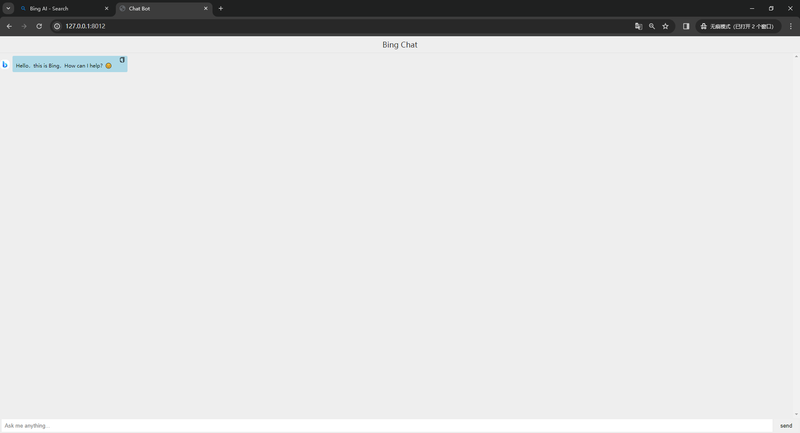

<p align="center">
  
  <h1 align="center">BingChat</h1>
  <p align="center">Web application of new Bing AI-powered chat</p>
</p>

<p align="center">
  <a href="https://opensource.org/licenses/Apache-2.0">
    
  </a>
</p>

## Pre requirements

- [Maven](https://maven.apache.org)
- [JDK1.8](https://jdk.java.net)

## Usage

- Sign in to your Microsoft account
- GET https://www.bing.com/turing/conversation/create?bundleVersion=1.1622.0 Request Cookie，Find **_
  U** parameter in cookie and replace **_U** in application.yml

**Note: VPN is required if new Bing is not available in your area. Make sure `bing.com` and its
subdomains are included in proxy rules.**

```
java -jar BingChat-1.0.0.jar
```

## Screenshot



## License

Apache-2.0 License
